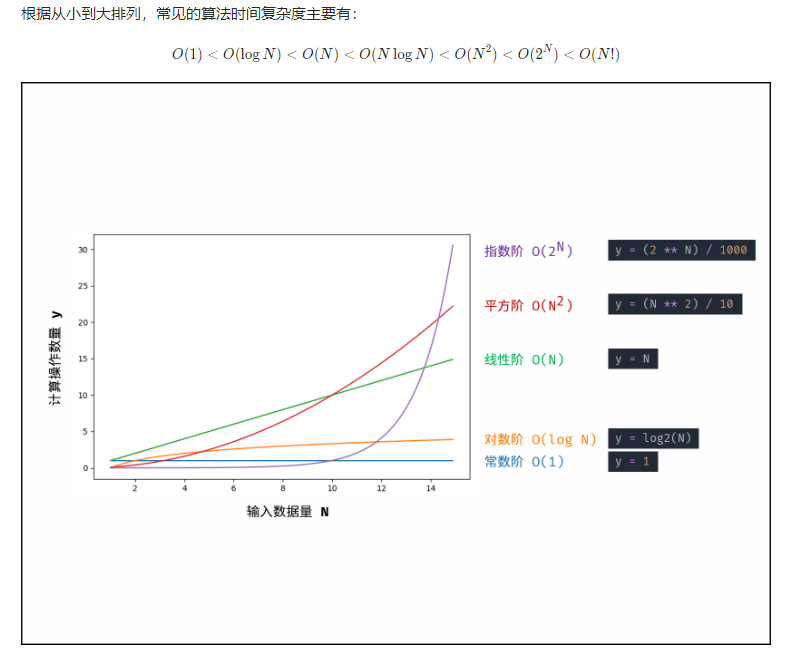
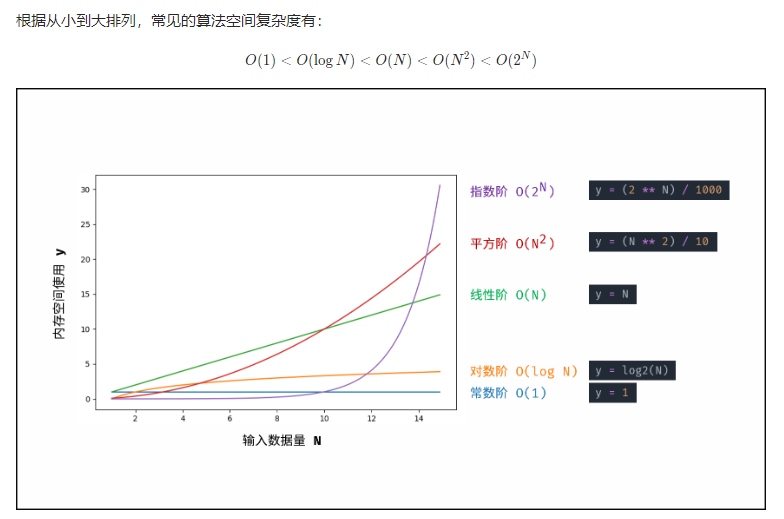

# 复杂度

算法复杂度旨在计算在输入数据量 `N` 的情况下，算法的时间使用和空间使用情况；体现算法运行使用的时间和空间随数据大小 `N` 而增大的速度。

算法复杂度主要可从时间、空间两个角度评价：

- 时间：假设各操作的运行时间为固定常数，统计算法运行的计算操作的数量，以代表算法运行所需时间；
- 空间：统计在最差情况下，算法运行所需使用的最大空间；

输入数据大小 `N` 指算法处理的输入数据量；根据不同算法，具有不同定义。

## 时间复杂度

根据定义，时间复杂度指输入数据大小为 `N` 时，算法运行所需花费的时间。需要注意：

- 统计的是算法的计算操作数量，而不是运行的绝对时间。计算操作数量和运行绝对时间呈正相关关系，并不相等。算法运行时间受到编程语言、计算机处理器速度、运行环境等多种因素影响。
- 体现的是计算操作随数据大小 `N` 变化时的变化情况。假设算法运行总共需要 `1` 次操作、 `100` 次操作，此两情况的时间复杂度都为常数级 `O(1)` ；需要 `N` 次操作、 `100N` 次操作的时间复杂度都为 `O(N)` 。

根据输入数据的特点，时间复杂度具有最差、平均、最佳三种情况，分别使用 `O, Θ, Ω` 三种符号表示。大 `O` 是最常使用的时间复杂度评价渐进符号。

## 空间复杂度

空间复杂度涉及的空间类型有：

- 输入空间：存储输入数据所需的空间大小；
- 暂存空间：算法运行过程中，存储所有中间变量和对象等数据所需的空间大小；
- 输出空间：算法运行返回时，存储输出数据所需的空间大小；

通常情况下，空间复杂度指在输入数据大小为 `N` 时，算法运行所使用的暂存空间加输出空间的总体大小。

而根据不同来源，算法使用的内存空间分为三类：

- 指令空间：编译后，程序指令所使用的内存空间。
- 数据空间：算法中的各项变量使用的空间，包括：声明的常量、变量、动态数组、动态对象等使用的内存空间。
- 栈帧空间：程序调用函数是基于栈实现的，函数在调用期间，占用常量大小的栈帧空间，直至返回后释放。算法中，栈帧空间的累计常出现于递归调用。

通常情况下，空间复杂度统计算法在“最差情况”下使用的空间大小，以体现算法运行所需预留的空间量，使用符号 `O` 表示。最差情况有两层含义，分别为最差输入数据、算法运行中的最差运行点。

