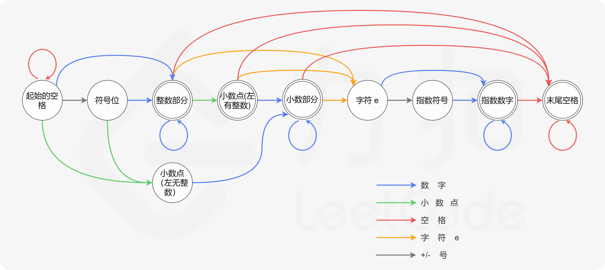

# 有效数字

## [65. 有效数字](https://leetcode.cn/problems/valid-number/)

## [LCR 138. 有效数字](https://leetcode.cn/problems/biao-shi-shu-zhi-de-zi-fu-chuan-lcof/)

> - ***Question***
>   - 有效数字（按顺序）可以分成以下几个部分：
>     - 若干空格；
>     - 一个小数或者整数；
>     - （可选）一个 'e' 或 'E' ，后面跟着一个整数；
>     - 若干空格；
>   - 小数（按顺序）可以分成以下几个部分：
>     - （可选）一个符号字符（'+' 或 '-'）；
>     - 下述格式之一：
>       - 至少一位数字，后面跟着一个点 '.'；
>       - 至少一位数字，后面跟着一个点 '.' ，后面再跟着至少一位数字；
>       - 一个点 '.' ，后面跟着至少一位数字；
>   - 整数（按顺序）可以分成以下几个部分：
>     - （可选）一个符号字符（'+' 或 '-'）；
>     - 至少一位数字；
>   - 部分有效数字列举如下 `["2", "0089", "-0.1", "+3.14", "4.", "-.9", "2e10", "-90E3", "3e+7", "+6e-1", "53.5e93", "-123.456e789"]` 。
>   - 部分无效数字列举如下 `["abc", "1a", "1e", "e3", "99e2.5", "--6", "-+3", "95a54e53"]` 。
>   - 给你一个字符串 `s` ，如果 `s` 是一个有效数字，请返回 `true` 。
>   - ***tips:***
>     - `1 <= s.length <= 20`
>     - `s` 仅含英文字母（大写和小写），数字（0-9），加号 '+' ，减号 '-' ，或者点 '.'

---

## *Java*

> - ***自动机***
>   - 

```java
// 我们没有单独地考虑每种字符，而是划分为若干类。由于全部 10 个数字字符彼此之间都等价，因此只需定义一种统一的数字类型即可。对于正负号也是同理。
// 在实际代码中，我们需要处理转移失败的情况。例如当位于状态 1（起始空格）时，没有对应字符 e 的状态。为了处理这种情况，我们可以创建一个特殊的拒绝状态。如果当前状态下没有对应读入字符的转移规则，我们就转移到这个特殊的拒绝状态。一旦自动机转移到这个特殊状态，我们就可以立即判定该字符串不被接受。
import java.util.HashMap;
import java.util.Map;

class Solution {

    public boolean isNumber(String s) {
        return validNumber(s);
    }

    public boolean validNumber(String s) {
        Map<State, Map<CharType, State>> transfer = new HashMap<State, Map<CharType, State>>();
        Map<CharType, State> initialMap = new HashMap<CharType, State>() {{
            put(CharType.CHAR_SPACE, State.STATE_INITIAL);
            put(CharType.CHAR_NUMBER, State.STATE_INTEGER);
            put(CharType.CHAR_POINT, State.STATE_POINT_WITHOUT_INT);
            put(CharType.CHAR_SIGN, State.STATE_INT_SIGN);
        }};
        transfer.put(State.STATE_INITIAL, initialMap);
        Map<CharType, State> intSignMap = new HashMap<CharType, State>() {{
            put(CharType.CHAR_NUMBER, State.STATE_INTEGER);
            put(CharType.CHAR_POINT, State.STATE_POINT_WITHOUT_INT);
        }};
        transfer.put(State.STATE_INT_SIGN, intSignMap);
        Map<CharType, State> integerMap = new HashMap<CharType, State>() {{
            put(CharType.CHAR_NUMBER, State.STATE_INTEGER);
            put(CharType.CHAR_EXP, State.STATE_EXP);
            put(CharType.CHAR_POINT, State.STATE_POINT);
            put(CharType.CHAR_SPACE, State.STATE_END);
        }};
        transfer.put(State.STATE_INTEGER, integerMap);
        Map<CharType, State> pointMap = new HashMap<CharType, State>() {{
            put(CharType.CHAR_NUMBER, State.STATE_FRACTION);
            put(CharType.CHAR_EXP, State.STATE_EXP);
            put(CharType.CHAR_SPACE, State.STATE_END);
        }};
        transfer.put(State.STATE_POINT, pointMap);
        Map<CharType, State> pointWithoutIntMap = new HashMap<CharType, State>() {{
            put(CharType.CHAR_NUMBER, State.STATE_FRACTION);
        }};
        transfer.put(State.STATE_POINT_WITHOUT_INT, pointWithoutIntMap);
        Map<CharType, State> fractionMap = new HashMap<CharType, State>() {{
            put(CharType.CHAR_NUMBER, State.STATE_FRACTION);
            put(CharType.CHAR_EXP, State.STATE_EXP);
            put(CharType.CHAR_SPACE, State.STATE_END);
        }};
        transfer.put(State.STATE_FRACTION, fractionMap);
        Map<CharType, State> expMap = new HashMap<CharType, State>() {{
            put(CharType.CHAR_NUMBER, State.STATE_EXP_NUMBER);
            put(CharType.CHAR_SIGN, State.STATE_EXP_SIGN);
        }};
        transfer.put(State.STATE_EXP, expMap);
        Map<CharType, State> expSignMap = new HashMap<CharType, State>() {{
            put(CharType.CHAR_NUMBER, State.STATE_EXP_NUMBER);
        }};
        transfer.put(State.STATE_EXP_SIGN, expSignMap);
        Map<CharType, State> expNumberMap = new HashMap<CharType, State>() {{
            put(CharType.CHAR_NUMBER, State.STATE_EXP_NUMBER);
            put(CharType.CHAR_SPACE, State.STATE_END);
        }};
        transfer.put(State.STATE_EXP_NUMBER, expNumberMap);
        Map<CharType, State> endMap = new HashMap<CharType, State>() {{
            put(CharType.CHAR_SPACE, State.STATE_END);
        }};
        transfer.put(State.STATE_END, endMap);

        int length = s.length();
        State state = State.STATE_INITIAL;

        for (int i = 0; i < length; i++) {
            CharType type = toCharType(s.charAt(i));
            if (!transfer.get(state).containsKey(type)) {
                return false;
            } else {
                state = transfer.get(state).get(type);
            }
        }
        return state == State.STATE_INTEGER || state == State.STATE_POINT || state == State.STATE_FRACTION || state == State.STATE_EXP_NUMBER || state == State.STATE_END;
    }

    public CharType toCharType(char ch) {
        if (ch >= '0' && ch <= '9') {
            return CharType.CHAR_NUMBER;
        } else if (ch == 'e' || ch == 'E') {
            return CharType.CHAR_EXP;
        } else if (ch == '.') {
            return CharType.CHAR_POINT;
        } else if (ch == '+' || ch == '-') {
            return CharType.CHAR_SIGN;
        } else if (ch == ' ') {
            return CharType.CHAR_SPACE;
        } else {
            return CharType.CHAR_ILLEGAL;
        }
    }

    enum State {
        STATE_INITIAL,
        STATE_INT_SIGN,
        STATE_INTEGER,
        STATE_POINT,
        STATE_POINT_WITHOUT_INT,
        STATE_FRACTION,
        STATE_EXP,
        STATE_EXP_SIGN,
        STATE_EXP_NUMBER,
        STATE_END
    }

    enum CharType {
        CHAR_NUMBER,
        CHAR_EXP,
        CHAR_POINT,
        CHAR_SIGN,
        CHAR_SPACE,
        CHAR_ILLEGAL
    }

}
```

---

> ***last change: 2024/3/18***

---
